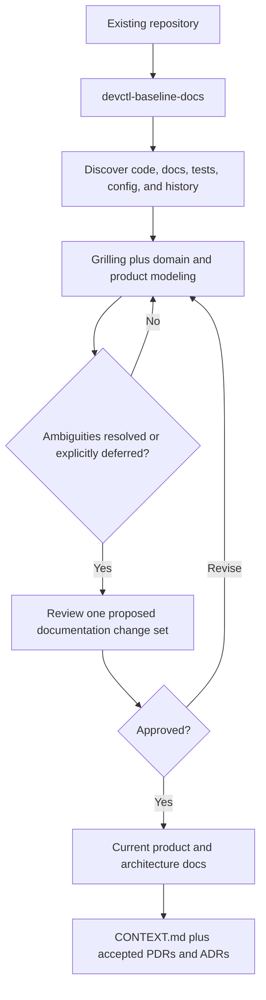
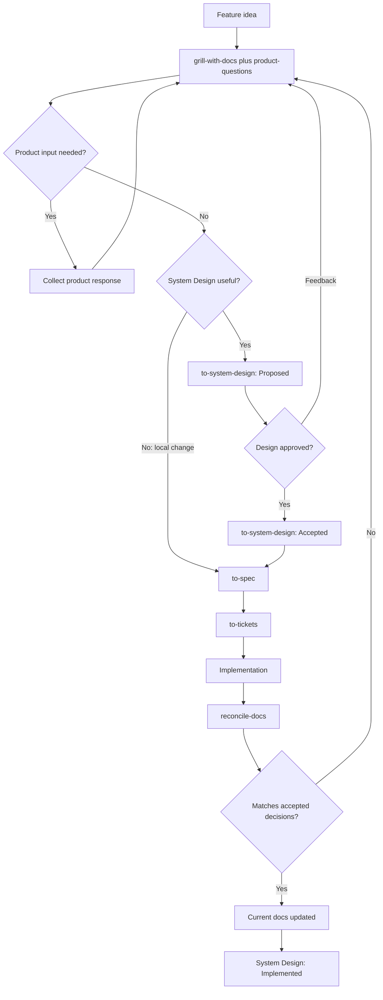

# Product and System Documentation Workflow

This guide explains how to use the Devctl documentation skills with Matt Pocock's engineering
skills. The workflow keeps current product and architecture documentation separate from decision
history and from temporary feature-planning artifacts.

## Prerequisites

Install the Devctl skills and the following skills from
[`mattpocock/skills`](https://github.com/mattpocock/skills):

- `setup-matt-pocock-skills`
- `grill-with-docs`
- `to-spec`
- `to-tickets`

Before publishing feature artifacts, configure the repository's issue tracker and domain-document
layout:

```text
Use $setup-matt-pocock-skills to configure this repository for the engineering workflow.
```

The configured tracker owns planning artifacts. Depending on the project configuration, an
artifact may be a GitHub or GitLab issue, a local Markdown file, or an item in another tracker.

## Documentation model

The durable repository documentation has four responsibilities:

```text
docs/
|-- README.md
|-- product/
|   |-- README.md
|   |-- <capability>.md
|   `-- decisions/
|       `-- NNNN-<slug>.md
|-- architecture/
|   |-- overview.md
|   |-- data-flow.md       optional
|   `-- deployment.md      optional
`-- adr/
    `-- NNNN-<slug>.md
```

```text
docs/product/            WHAT the product does now
docs/product/decisions/  WHY significant product behavior was chosen
docs/architecture/       HOW the system works now
docs/adr/                WHY significant technical architecture was chosen
```

`CONTEXT.md` remains a domain glossary. Current product and architecture documents describe the
implemented system, not a planned future state. Product Decision Records (PDRs) and Architecture
Decision Records (ADRs) preserve significant accepted decisions. Product questions, System
Designs, implementation specs, and tickets live in the configured tracker.

Canonical formats:

- [Current documentation model](../skills/devctl-baseline-docs/references/DOCUMENTATION-MODEL.md)
- [PDR format](../skills/product-modeling/references/PDR-FORMAT.md)
- [Product-question behavior](../skills/product-questions/SKILL.md)
- [System Design format](../skills/to-system-design/references/SYSTEM-DESIGN-FORMAT.md)

## Skill responsibilities

| Skill                       | Use it when                                                     | Output and handoff                                                                  |
|-----------------------------|-----------------------------------------------------------------|-------------------------------------------------------------------------------------|
| `$setup-matt-pocock-skills` | Preparing a repository for the workflow                         | Tracker and domain-doc conventions consumed by publishing skills                    |
| `$devctl-baseline-docs`     | Establishing an existing repository's initial accepted baseline | Current docs, `CONTEXT.md`, and qualifying PDRs/ADRs                                |
| `$grill-with-docs`          | Resolving a feature's design tree                               | Confirmed domain terms and qualifying ADRs; shared conversation for later synthesis |
| `$product-modeling`         | Product behavior or business rules are being discussed          | Sharpened scenarios and qualifying accepted PDRs; activates automatically           |
| `$product-questions`        | Some product decisions may need thought or external approval    | One question-and-answer artifact for the feature                                    |
| `$to-system-design`         | A non-trivial feature is ready for architecture review          | Proposed, then Accepted, System Design reference                                    |
| `$to-spec`                  | Product and design decisions are accepted                       | Implementation-oriented feature spec                                                |
| `$to-tickets`               | The implementation spec is ready to execute                     | Ordered implementation tickets                                                      |
| `$reconcile-docs`           | The implementation is complete or under final review            | Updated current docs and an Implemented System Design                               |

## Bootstrap an existing repository

Run the baseline once, then rerun it only when the repository never received a complete baseline
or its documented foundations need deliberate re-establishment.



```text
Use $devctl-baseline-docs to discover this repository and establish its accepted product and
technical documentation baseline.
```

The skill performs discovery and interviewing before writing. It creates only useful current-state
documents and uses Mermaid only when a relationship, flow, state transition, or deployment
topology is clearer visually.

## Plan and deliver a feature

The standard feature flow keeps product clarification, architecture approval, implementation
planning, and current-documentation updates as explicit handoffs.



### 1. Interview the feature

Attach `product-questions` at the start so it can capture a question as soon as you say that it
needs thought or external approval. If no such question appears, it creates no artifact.
`product-modeling` activates automatically when the conversation covers product behavior.

```text
Use $grill-with-docs and $product-questions to work through <feature>. Continue until every
currently answerable branch of the design tree is resolved.
```

### 2. Return product responses

The product response may use any convenient format. The skill maps unambiguous answers to their
questions, preserves them faithfully, and keeps answered questions in the feature artifact.

```text
Use $grill-with-docs and $product-questions to resume <feature> from <product-questions-ref>.
The product response is: <response>.
```

An open blocking question pauses only the dependent design branch; the rest of the interview can
continue. The question artifact moves from `Open` to `Resolved` after every question is answered.

### 3. Publish a System Design when useful

A separate System Design review is recommended when the feature changes important flows,
component boundaries, data or API contracts, integrations, deployment, or meaningful technical
trade-offs. A small local behavior change can proceed directly to `to-spec`.

```text
Use $to-system-design to synthesize and publish the agreed design for <feature>.
```

The new artifact starts as `Proposed`. The skill synthesizes confirmed decisions; when it uncovers
a hidden decision or blocking question, return to the feature interview instead of accepting an
assumption.

### 4. Resolve design-review feedback

First resolve the feedback as a design decision, then update the existing artifact rather than
creating a second System Design.

```text
Use $grill-with-docs and $product-questions to resolve this review feedback for <feature>:
<feedback>.
```

```text
Use $to-system-design to update <system-design-ref> with the confirmed review decisions.
```

After explicit approval:

```text
Use $to-system-design to mark <system-design-ref> Accepted. The design has been explicitly
approved.
```

Acceptance completes the architecture-review artifact; it does not claim the feature has already
been implemented.

### 5. Create the implementation spec and tickets

Pass the Accepted System Design explicitly so `to-spec` does not guess which feature design to
use. For a feature that reasonably skipped System Design, pass the completed conversation instead.

```text
Use $to-spec to create the implementation spec from Accepted System Design <system-design-ref>.
```

```text
Use $to-tickets to turn <spec-ref> into ordered implementation tickets.
```

The System Design answers whether the architecture should be approved. The spec and tickets answer
what an implementation agent must build and how the result will be verified.

### 6. Reconcile implemented behavior

After implementation or final code review, reconcile the actual change rather than copying the
proposal into current docs. Explicit references are helpful but optional when the current PR,
branch, tracker links, and conversation identify one feature unambiguously.

```text
Use $reconcile-docs to reconcile the implemented <feature> with its current product and
architecture documentation. Relevant references: <optional design, spec, and change refs>.
```

If implementation materially differs from accepted decisions, return that branch to grilling and
record any qualifying PDR or ADR before updating current truth. When implementation and decisions
agree, `reconcile-docs` updates every affected current document and moves the System Design from
`Accepted` to `Implemented`.

## The three feedback loops

1. **Product response:** give the response back to `$grill-with-docs` and `$product-questions`;
   resume only the branches it unblocks.
2. **Design review:** resolve feedback through grilling, then update the same System Design and
   request approval again.
3. **Implementation drift:** resolve whether the design or implementation should change before
   `$reconcile-docs` promotes anything to current truth.

Product roadmaps remain in the configured tracker. This workflow does not create or maintain
application user guides.
