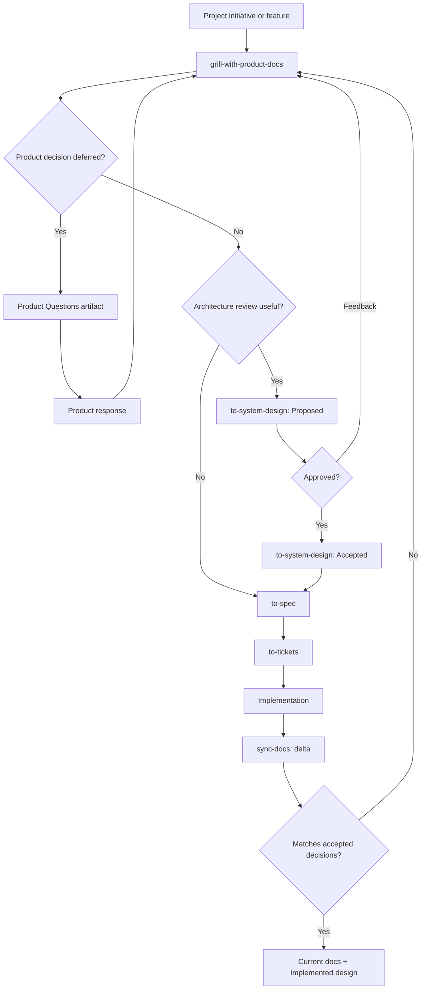

# Product and System Documentation Workflow

This workflow composes Devctl documentation skills with Matt Pocock's engineering primitives. It
keeps planning artifacts separate from implemented truth while giving the user one interview
entrypoint and one synchronization entrypoint.

## Setup once

Install the Devctl skills and these skills from
[`mattpocock/skills`](https://github.com/mattpocock/skills):

- `setup-matt-pocock-skills`
- `grilling`
- `domain-modeling`
- `to-spec`
- `to-tickets`

Configure the repository before the first workflow that publishes an artifact:

```text
Use $setup-matt-pocock-skills to configure this repository for the engineering workflow.
```

Setup records the issue tracker and the single- or multi-context domain-document layout. If a
publishing skill cannot find that configuration, it stops before publication, gives this exact
handoff, and resumes its current phase after setup.

## Ownership

Each durable concern has one owner:

| Concern | Owner |
|---|---|
| Interview strategy and design frontier | `$grilling` |
| Domain glossary and ADRs | `$domain-modeling` plus `docs/agents/domain.md` |
| Product behavior, current-product policy, PDRs, and deferred product decisions | `$product-modeling` |
| Current documentation synchronization and architecture docs | `$sync-docs` |
| Proposed architecture review | `$to-system-design` |
| Implementation spec and tickets | `$to-spec` and `$to-tickets` |

Canonical references:

- [Product documentation model](../skills/product-modeling/references/PRODUCT-DOCS.md)
- [PDR format](../skills/product-modeling/references/PDR-FORMAT.md)
- [Deferred product questions](../skills/product-modeling/references/DEFERRED-QUESTIONS.md)
- [Current documentation model](../skills/sync-docs/references/CURRENT-DOCS.md)
- [System Design format](../skills/to-system-design/references/SYSTEM-DESIGN-FORMAT.md)

Current product and architecture documents describe implemented behavior. Accepted PDRs and ADRs
preserve significant decision history. Product Questions, System Designs, specs, and tickets are
planning artifacts in the configured tracker.

## Start a new project

A new project is the first initiative through the feature flow; it does not need a separate
baseline workflow. After setup, start at [Shape the project or feature](#1-shape-the-project-or-feature):

```text
Use $grill-with-product-docs to shape <project> as its first product initiative.
```

Before anything is implemented, the repository may contain confirmed glossary terms, qualifying
ADRs or PDRs, and tracker artifacts. It has no current product or architecture behavior to
document yet. The first delta `$sync-docs` run creates those current documents after delivery.

## Start with an existing project

An implemented project without a reliable documentation baseline takes one additional on-ramp:

```text
Use $sync-docs to establish a full documentation baseline for this existing project.
```

The full sync discovers the whole implemented system, resolves or explicitly defers material
ambiguities, presents one documentation change set, and writes only after approval. Once the
baseline is established, every new change follows the same feature flow as a new project.

## Feature flow


```mermaid
flowchart TD
    Start["Project initiative or feature"] --> Interview["grill-with-product-docs"]
    Interview --> Deferred{"Product decision deferred?"}
    Deferred -->|Yes| Questions["Product Questions artifact"]
    Questions --> Response["Product response"]
    Response --> Interview
    Deferred -->|No| DesignUseful{"Architecture review useful?"}
    DesignUseful -->|No| Spec["to-spec"]
    DesignUseful -->|Yes| Design["to-system-design: Proposed"]
    Design --> Review{"Approved?"}
    Review -->|Feedback| Interview
    Review -->|Yes| Accepted["to-system-design: Accepted"]
    Accepted --> Spec
    Spec --> Tickets["to-tickets"]
    Tickets --> Implementation["Implementation"]
    Implementation --> Sync["sync-docs: delta"]
    Sync --> Drift{"Matches accepted decisions?"}
    Drift -->|No| Interview
    Drift -->|Yes| Current["Current docs + Implemented design"]
```

### 1. Shape the project or feature

`grill-with-product-docs` is a thin explicit facade over `grilling`, `domain-modeling`, and
`product-modeling`:

```text
Use $grill-with-product-docs to work through <subject> until every currently answerable branch of
the design tree is resolved.
```

`grilling` owns which questions to ask and in what order. `product-modeling` handles product rules,
decision authority, PDR qualification, and the boundary between proposals and current truth.
`domain-modeling` handles canonical terms and qualifying ADRs.

When a product decision needs later thought or an external authority, `product-modeling` offers to
create or update one Product Questions artifact for the subject. It asks for approval before the
first tracker mutation. Ordinary interview questions are never persisted there, and only the
dependent design branch pauses.

Return a product response through the same facade:

```text
Use $grill-with-product-docs to resume <subject> from <product-questions-ref>.
The product response is: <response>.
```

The response is kept faithfully. If it settles the decision, `product-modeling` applies its normal
PDR qualification and links any resulting PDR from the question artifact.

At the end of the interview, the facade recommends exactly one next skill: `to-system-design` when
architecture review is useful, or `to-spec` for a local change.

### 2. Review system design when useful

Use a System Design when the change affects important flows, component boundaries, data or API
contracts, integrations, deployment, or meaningful technical trade-offs:

```text
Use $to-system-design to synthesize and publish the agreed design for <subject>.
```

The artifact begins as `Proposed`. Hidden decisions and blocking questions return to
`grill-with-product-docs`; synthesis never accepts an assumption. Review feedback follows the same
loop, then updates the existing artifact:

```text
Use $grill-with-product-docs to resolve this review feedback for <subject>: <feedback>.
Use $to-system-design to update <system-design-ref> with the confirmed decisions.
```

After explicit approval:

```text
Use $to-system-design to mark <system-design-ref> Accepted. The design has been explicitly
approved.
```

A small local change may skip this phase and proceed directly to `to-spec`.

### 3. Create the spec and tickets

Pass an Accepted System Design explicitly when one exists; otherwise synthesize from the completed
interview:

```text
Use $to-spec to create the implementation spec from Accepted System Design <system-design-ref>.
Use $to-tickets to turn <spec-ref> into ordered implementation tickets.
```

The System Design owns reviewable architecture. The spec and tickets own implementation behavior,
verification, vertical slices, and blocking edges.

### 4. Synchronize delivered truth

After implementation or final code review, run a delta synchronization against the actual change:

```text
Use $sync-docs to synchronize the implemented <subject> with its durable documentation. Relevant
references: <optional design, spec, PR, commit, or branch refs>.
```

`sync-docs` compares the implementation with accepted decisions, presents one change set, and
writes only after approval. Material drift returns to `grill-with-product-docs`. Once the evidence
and decisions agree, it updates current product, architecture, glossary, and decision documents
and moves an Accepted System Design to `Implemented`.

Product roadmaps remain in the configured tracker. This workflow does not create or maintain
application user guides.
